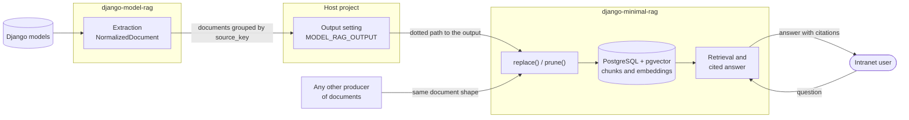
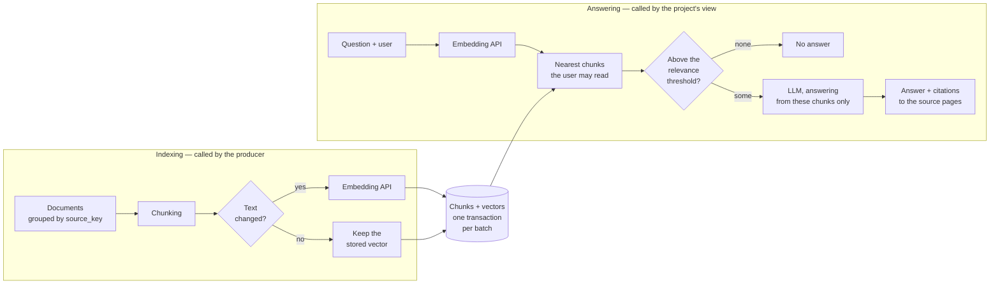

# Roadmap

How django-minimal-rag gets built. Each feature below is one branch and one
pull request, built test-first with the `/tdd:feature` workflow (see
[AGENTS.md](AGENTS.md)). The detailed list of behaviors of a feature is
agreed when that feature starts, not here. The pull request that completes a
feature also ticks it here.

Unlike [django-model-rag](https://github.com/gtolivier/django-model-rag),
this package has no prototype to rewrite: it starts with a design pass (see
"Open questions"), and the features below are provisional until that pass
is done.

## Architecture

django-minimal-rag never imports django-model-rag, and django-model-rag
never imports it: the host project connects them, by naming
django-minimal-rag's output in its settings.
[django-model-rag-demo](https://github.com/gtolivier/django-model-rag-demo)
installs both and type-checks them together.

Inside the package, two paths share the storage:

## Decisions

Settled already, mostly by django-model-rag's output, which this package
implements.

- **A Django app.** Storage relies on `pgvector.django` (`VectorField`,
  migrations, the project's `DATABASES`): the package requires PostgreSQL
  with the pgvector extension, and its models come with migrations
  generated by `makemigrations`.
- **No dependency on django-model-rag, either way.** This package indexes
  any document of the right shape, whatever produced it. Its indexing API is
  therefore an API of its own, usable directly, not an adapter for
  django-model-rag.
- **The document is a Protocol, defined here.** A `typing.Protocol`
  describes what this package reads from a document (`text`, `title`, `url`,
  `source_key`…), with read-only members (`@property`), so that a dataclass
  field and a property both satisfy it. django-model-rag's
  `NormalizedDocument` satisfies it by its shape alone. Its exact members
  are settled by the design pass: they must match attribute names that
  django-model-rag already treats as a contract.
- **The output is django-model-rag's Protocol, satisfied by shape.**
  `replace(groups)` takes a mapping of `source_key` to the complete
  sequence of that source's documents, and replaces everything stored for
  each source; an empty sequence removes it. `prune(model_label,
  kept_keys)` removes the sources of a model that are not in `kept_keys`
  (`model_label` is the part of `source_key` before the colon, so
  `app.note` never matches `app.notebook:3`). The name of `prune`'s first
  argument must stay meaningful for a project that does not use
  django-model-rag.
- **`source_key` identifies a group, not a document.** Chunks are
  identified within their group. Since every call replaces whole groups, a
  replayed call gives the same result, and comparing texts lets the package
  re-embed only what changed.
- **Each `replace()` is applied in a transaction.** The atomicity of a batch
  belongs to this package, and so do transient errors such as a
  rate-limited embedding API, retried with backoff: the producer cannot
  tell which exceptions are transient.
- **Answers come from the retrieved chunks only.** Chunks below a relevance
  threshold are discarded before the LLM is called; with none left, there
  is no answer rather than an answer from the LLM's own knowledge. Each
  answer cites the documents it used, by their `url`.
- **Extras only for optional backends.** An extra (`pip install
  django-minimal-rag[...]`) is acceptable only for a dependency that does
  not change the release cycle or the test matrix — a background-task
  backend, for instance. Anything needing its own release cycle is a
  separate package.

## Open questions

To settle in the design pass, before feature 1.

- **The document Protocol:** which members, which are optional (`title`,
  `url`, `language`, `metadata`, `permissions`), and what an unknown
  `language` (`None`) means — falling back on `LANGUAGE_CODE` or not.
- **Chunking:** by characters, tokens or structure (paragraphs, headings);
  size and overlap; whether the title is repeated in each chunk.
- **Embeddings:** how a project chooses its embedding API (a setting shaped
  like `STORAGES`, as for the output?), the vector dimension that a
  migration fixes, and what changing models means for stored vectors.
- **Permission filtering:** documents carry permission names
  (`app_label.codename`); filtering them in the vector query rather than
  after it, so that a user never gets fewer results than allowed — or an
  answer built from chunks they may not read.
- **Relevance threshold:** which distance (cosine, inner product), and
  whether the threshold is a setting, a per-query argument, or both.
- **The LLM:** how a project chooses it, the prompt, the shape of a
  citation, and whether answers are streamed.
- **Synchronous or deferred indexing:** whether `replace()` embeds before
  returning, or stores the texts and leaves embedding to a background
  task (a candidate for an extra).

## Features

Provisional: the design pass may reorder, split or merge them.

- [ ] **0. Test bench.** pytest-django, test settings using PostgreSQL with
  pgvector, and a PostgreSQL service in CI.
- [ ] **1. The document Protocol.** Checked by a document class of the test
  bench, without django-model-rag.
- [ ] **2. Chunking.** A document's text split into chunks, each knowing
  its rank within its group.
- [ ] **3. Storage.** Models for sources and chunks, with their vector
  field and migration.
- [ ] **4. Embeddings.** The embedding backend, chosen by a setting, with a
  fake backend for tests.
- [ ] **5. `replace()`.** Groups replaced in a transaction; empty groups
  removed; unchanged texts not re-embedded.
- [ ] **6. `prune()`.** Sources of a model that are not kept are removed.
- [ ] **7. Retrieval.** The nearest chunks to a question, above the
  relevance threshold.
- [ ] **8. Permission filtering.** Only chunks the user may read are
  retrieved.
- [ ] **9. Cited answers.** The LLM answers from the retrieved chunks, with
  citations to their sources.

## Not planned here

- **Extracting documents from Django models** is django-model-rag's job.
- **Backends other than PostgreSQL with pgvector.**
